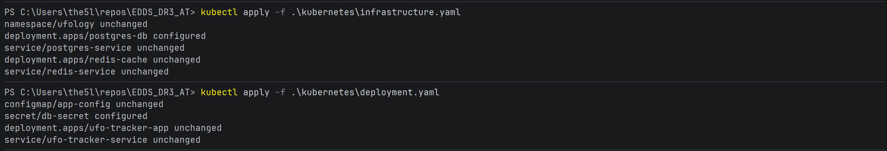
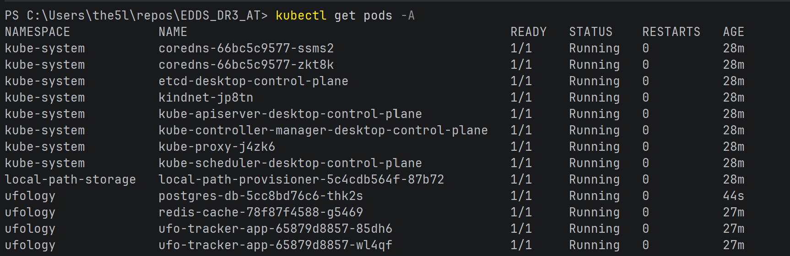
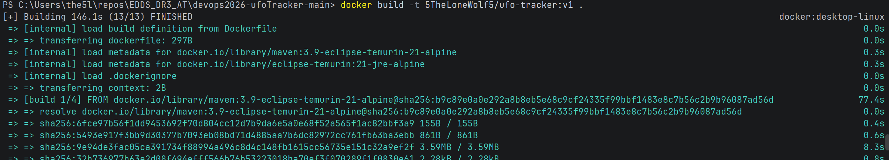
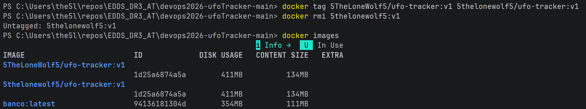
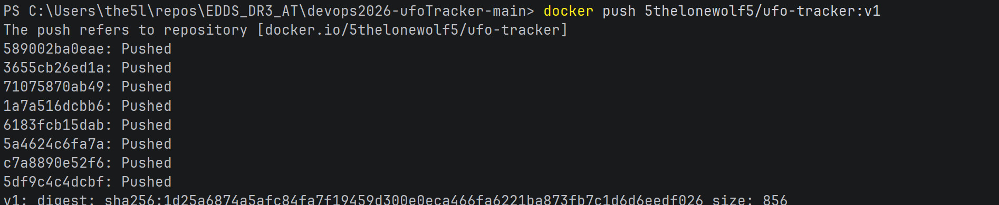
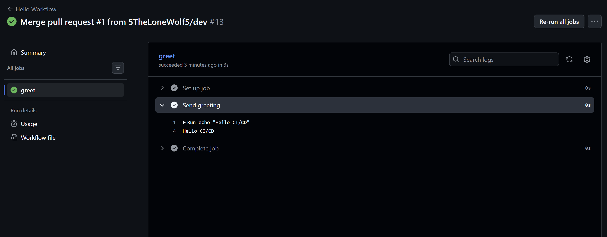
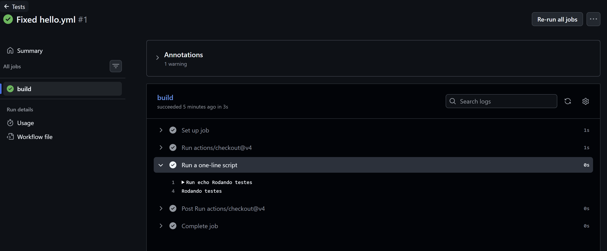
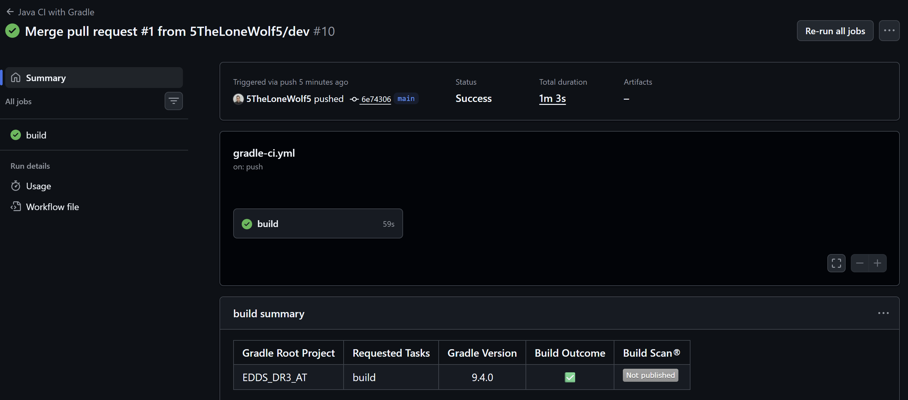
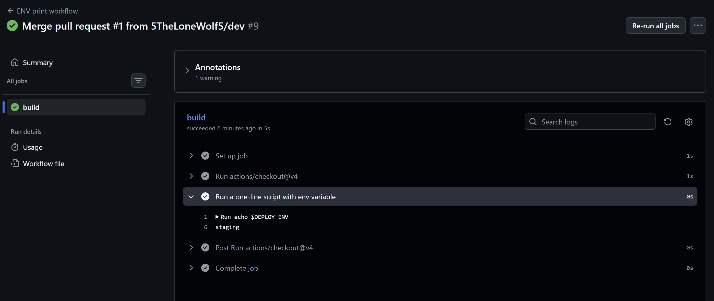
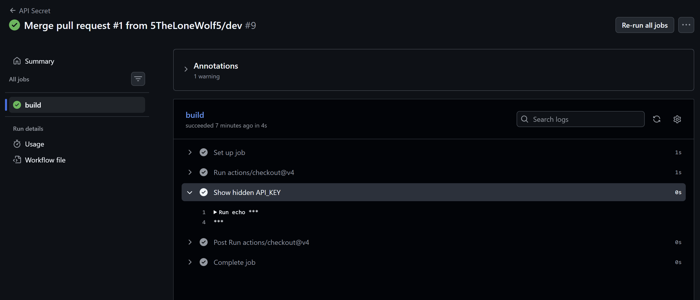

# | Assessment | Pipelines de CI/CD e DevOps |

### Orquestração de Containers com Kubernetes

Os arquivos YAML estão organizados e presentes na pasta _kubernetes/_ dentro deste repositório.

###### Parte 1:

###### Parte 2:

### Dockerfile da aplicação esquecida

O arquivo Dockerfile está disponível em <i>devops2026-ufoTracker-main/Dockerfile</i> dentro deste repositório.

- Build da imagem:

- Mudança de nome da imagem:

- Push da imagem:

- Link para a imagem no repositório Docker:

https://hub.docker.com/r/5thelonewolf5/ufo-tracker

### Workflows Básicos no GitHub Actions

- hello.yml:

https://github.com/5TheLoneWolf5/EDDS_DR3_AT/actions/runs/24226603307

- tests.yml:

https://github.com/5TheLoneWolf5/EDDS_DR3_AT/actions/runs/24226609118

- gradle-ci.yml:

https://github.com/5TheLoneWolf5/EDDS_DR3_AT/actions/runs/24226611359

### Runners, Variáveis e Segurança

- env-demo.yml:

https://github.com/5TheLoneWolf5/EDDS_DR3_AT/actions/runs/24226611376

- secret-demo.yml:

https://github.com/5TheLoneWolf5/EDDS_DR3_AT/actions/runs/24226611360

### Diferença entre runners hospedados pelo GitHub e auto-hospedados, citando vantagens e desvantagens:

Os runners hospedados pelo GitHub são máquinas já preparadas pelo GitHub, que executam jobs no workflow.
Já runners auto-hospedados podem ser preparados e customizados pelo desenvolvedor no repositório (com uma máquina dedicada).

Os runners hospedados pelo GitHub oferecem a facilidade e simplicidade de setup, com a desvantagem sendo a falta de flexibilidade e customização. 
Isso é diferente da maneira self-hosted, que te dá a liberdade de configurar um ambiente próprio e personalizado (hardware e software) para a execução dos workflows.
Porém, existe a desvantagem da complexidade e tempo gasto para preparar e manter todo esse ambiente.
